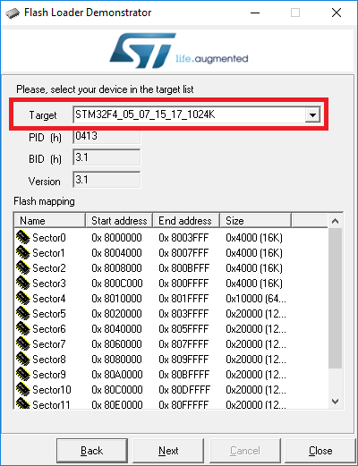
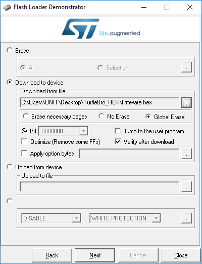

# Firmware update

Update procedure requires use of USB-UART bridge and STM32 Flash loader demonstrator programm. You can download firmware from our repository. Update procedure is done as follows:\


* Turn off the robot and pull out its battery.
* Connect USB-UART bridge to the ST-UPDT connector on the mainboard (its blue). Pay attention to proper connection of data pins - bridge's TX and RX pins should be connected to the RX and TX pins of motherboard accordingly.&#x20;


3V3 pin of the ST-UPDT connector must be connected to 3.3V Volts source only! Connecting it to 5 Volts may result in device malfunction!


* Set 4th group of DIP-switch to "ON" position
* Connect USB-UART bridge to your PC, the system should recognize it as COM-port.
* Press "HW\_RESET" switch on the mainboard, this should lead to all the LEDs go out and mainboard turn into update mode.
*   Launch STM32 Flash loader demonstrator, choose your UART bridge COM port number. Press "Next".




You should see the message:

> ```
> Target is readable. Please click "Next" to proceed
> ```


If this did not happen, check previous steps and try again


Next screen should show you something like this:


Pay attention to Target field: its contents should exactly match the picture above.

In the next screen you should set up setting exactly like follows:




Download from file field should contain path to the firmware file you've downloaded from our site. Pop-up window of this field does not display .hex files like one we're looking for by default so you have to choose hex Files (\*.hex) in the right lower corner field.


After pressing "Next", firmware update procedure should start. It can take a while, so please, be patient. After update is complete you should see the message:&#x20;

> ```
> Download operation finished succesfully
> ```

* Exit the programm
* Disconnect UART bridge from the PC
* Disconnect mainboard ST-UPDT connector
* Set 4th group of DIP-switch to "OFF" position


On the next startup robot will use updated firmware


